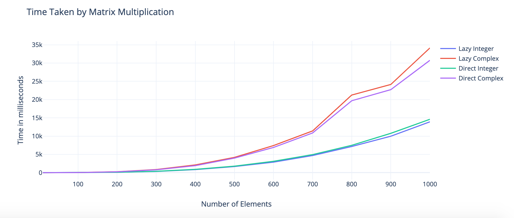

# Simple Matrix

Simple Matrix lib for **Programming competency test**

- Supported numerical types (```int```, ```long```, ```float```, ```double```, ```complex```,....)
- Supported algebraic expressions including ```+``` and ```*```, ```+=``` and ```*=```
- fits in one header file
- provides test header in test directory

# How To Compile!
    1. make or cmake CMakeLists.txt then make
    2. To run ./bin/Simple_Matrix because output is inside bin

# Speed Test in milliseconds

#### Addition

| Type       | Shape       | Execution time (in ms)  |Execution time for assignment (in ms) |
| :--------: | :---------: |:-----------------------|:----------------------------------:|
| `int`      | (1000,1000) | 37                      | 44                                   |
| `complex`  | (1000,1000) | 72                      | 71                                   |

#### Subtraction

| Type       | Shape       | Execution time (in ms)  |Execution time for assignment (in ms)  |
| :--------: | :---------: |:-----------------------|:----------------------------------:|
| `int`      | (1000,1000) | 36                      | 44                                   |
| `complex`  | (1000,1000) | 72                      | 72                                  |

#### Multiplication

| Type       | Shape       | Execution time for Direct (in ms)  |Execution time for Lazy (in ms) |Execution  time for Lazy assignment (in ms) |
| :--------: | :---------: |:---------------------: |:----------------------------------:  |:----------------------------------:  |
| `int`      | (1000,1000) | 14618                   |13925                                 |13312                                 |
| `complex`  | (1000,1000) | 31407                   |32080                                 |32121                                 |

## Time Taken by Matrix Multiplication


# System Specs
- OS: MacOS
- Processor: 2.5 GHz Intel Core i7
